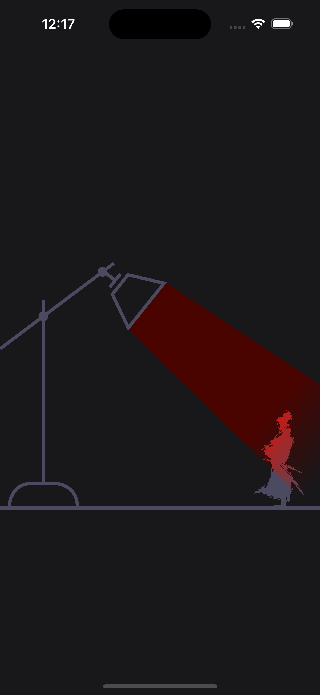

# Samurai Retribution 

I crafted this project during my SwiftUI animation learning path, exploring the use of ```animation``` and ```blendMode```.

## Inspiration 💡

I was inspired by .
The main idea of this source code is based on [Animated 404 page](https://dribbble.com/shots/18095622-Animated-404-page) created by [Olga Tsebro](https://dribbble.com/Olga_Tsebro).

## Screenshots 🌃



## Assets 🌃

- [Sword icon](https://www.flaticon.com/free-icon/sword_4155948?term=sword&related_id=4155948)
- [Samurai character](https://www.cleanpng.com/png-japan-samurai-clip-art-samurai-transparent-backgro-97913/)

## The tech stack used in this project 🛠

- SwiftUI
- Animation (spring)
- Shape (Path)
- blendMode
- mask

## Tools

- Xcode 15.2
- Swift 5.9.2

## Usage

1. Clone the repository:

  ``` bash
    git clone https://github.com/helloItsHEssam/SamuraiRetribution.git
  ```

###  Contributing 🤝

Contributions, issues, and feature requests are welcome! Feel free to fork the repository and submit a pull request with your changes.

## License

Please check [LICENSE](LICENSE) for details.